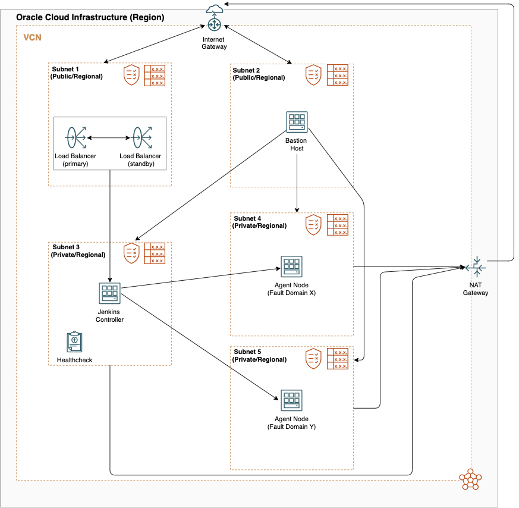

# oci-jenkins

These are Terraform modules that deploy [Jenkins](https://jenkins.io/) on [Oracle Cloud Infrastructure (OCI)](https://cloud.oracle.com/en_US/cloud-infrastructure).

## About
The Jenkins Oracle Cloud Infrastructure Module provides a Terraform-based Jenkins cluster installation for Oracle Cloud Infrastructure (OCI). Jenkins is a distributed automation server, generally associated with Continuous Integration (CI) and Continuous Delivery (CD). A Jenkins cluster typically involves one or more Controller instance(s) coupled with one or more Agent instance(s).



## Prerequisites
1. Download and install Terraform (v0.14 or later)
2. Download and install the OCI Terraform Provider (v2.0.0 or later)
3. Export OCI credentials. (this refer to the https://github.com/oracle/terraform-provider-oci )
4. An existing VCN with subnets, and those subnets need internet access in order to download Java and Jenkins.


## What's a Module?
A Module is a canonical, reusable, best-practices definition for how to run a single piece of infrastructure, such as a database or server cluster. Each Module is created using Terraform, and includes automated tests, examples, and documentation. It is maintained both by the open source community and companies that provide commercial support.
Instead of figuring out the details of how to run a piece of infrastructure from scratch, you can reuse existing code that has been proven in production. And instead of maintaining all that infrastructure code yourself, you can leverage the work of the Module community to pick up infrastructure improvements through a version number bump.

## How to use this Module
Each Module has the following folder structure:
* [root](): This folder contains a root module calls jenkins-controller and jenkins-agent sub-modules to create a Jenkins cluster in OCI.
* [modules](): This folder contains the reusable code for this Module, broken down into one or more modules.
* [examples](): This folder contains examples of how to use the modules.
  - [example-1](examples/example-1): This is an example of how to use the terraform_oci_jenkins module to deploy a Jenkins cluster in OCI by using an existing VCN, Security list and Subnets.
  - [example-2](examples/example-2): This example creates a VCN in Oracle Cloud Infrastructure including default route table, DHCP options, security list and subnets from scratch, then use terraform_oci_jenkins module to deploy a Jenkins cluster.

To deploy Jenkins Cluster servers using this Module:

```hcl
module "jenkins" {
  source              = "github.com/oci-quickstart/oci-quickstart-jenkins"
  compartment_ocid    = "${var.compartment_ocid}"
  controller_ad           = "${var.controller_ad}"
  controller_subnet_id    = "${var.controller_subnet_id}"
  agent_count         = "${var.agent_count}"
  agent_ads           = "${var.agent_ads}"
  agent_subnet_id     = "${var.agent_subnet_id}"
  ssh_authorized_keys = "${var.ssh_authorized_keys}"
  ssh_private_key     = "${var.ssh_private_key}"
}

```

Argument | Description
--- | ---
compartment_ocid | Compartment's OCID where VCN will be created
ssh_authorized_keys | Public SSH key to be included in the ~/.ssh/authorized_keys file for the default user on the instance
ssh_private_key | The private key to access instance
label_prefix | To create unique identifier for multiple clusters in a compartment.
controller_ad  | The Availability Domain for Jenkins Controller.
controller_subnet_id | The OCID of the Controller subnet to create the VNIC in.
controller_display_name | The name of the Controller instance.
controller_image_id | The OCID of an image for a Controller instance to use. You can refer to https://docs.us-phoenix-1.oraclecloud.com/images/ for more details.
controller_shape | The shape to be used on the Controller instance.
controller_flex_shape_ocpus | The number of OCPUs to be used on the Controller instance with Flexible shapes.
controller_flex_shape_memory | The amount of Memory in GB to be used on the Controller instance with Flexible shapes.
controller_user_data | Provide your own base64-encoded data to be used by Cloud-Init to run custom scripts or provide custom Cloud-Init configuration for Controller instance.
agent_count | Number of agent instances to launch.
agent_ads | The list of Availability Domains for Jenkins agent.
agent_subnet_ids | The list of Jenkins agent subnets' id.
agent_display_name | The name of the agent instance.
agent_image_id | The OCID of an image for agent instance to use. You can refer to https://docs.us-phoenix-1.oraclecloud.com/images/ for more details.
agent_shape | The shape to be used on the agent instance
agent_flex_shape_ocpus | The number of OCPUs to be used on the agent instance with Flexible shapes.
agent_flex_shape_memory | The amount of Memory in GB to be used on the agent instance with Flexible shapes.
http_port | The port to use for HTTP traffic to Jenkins.
jnlp_port | The Port to use for Jenkins Controller to agent communication between instances.
plugins | The list of plugins to pre-install on the Controller instance.
use_bastion_service | Bastion Service usage instead of Bastion Host
bastion_service_id | Bastion Service OCID (only when use_bastion_service=True)
bastion_service_region | Bastion Service Region (only when use_bastion_service=True)
bastion_host | Bastion Host Public IP (in case of the Bastion Service pass "host.bastion.${var.region}.oci.oraclecloud.com")
bastion_user | Bastion User (in most of the cases "opc")
bastion_private_key | The private key path to access the bastion host.

